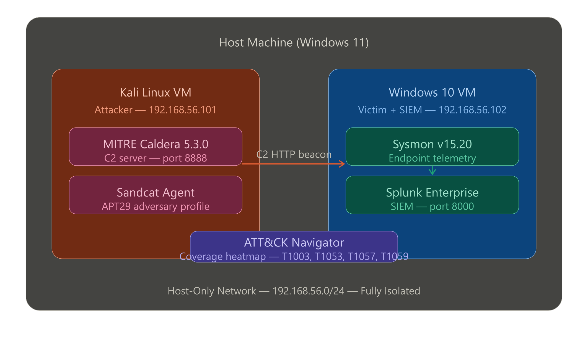

# Adversary Emulation & Detection Validation Lab

A home lab that simulates real-world cyberattacks using MITRE Caldera and measures detection coverage using Splunk as the SIEM.

---

## Architecture


```

## Tools

| Tool | Role | Version |
|------|------|---------|
| MITRE Caldera | Adversary emulation / C2 | 5.x |
| Splunk Free | SIEM / log analysis | Latest |
| Sysmon | Endpoint telemetry | v15.x |
| Windows 10 | Victim VM | 22H2 |
| ATT&CK Navigator | Coverage heatmap | v4.x |

---

## Lab Setup

See [`lab-setup/`](lab-setup/) for full configuration files and setup instructions.

**Quick Overview:**
1. Deploy Caldera server (Linux VM or Docker)
2. Deploy Windows 10 victim VM (isolated network)
3. Install Sysmon with tuned config on victim
4. Configure Splunk inputs.conf to ingest Windows and Sysmon logs
5. Install Caldera agent (Sandcat) on victim
6. Import ATT&CK Navigator layer for coverage tracking

---

## Operations

Each folder under [`operations/`](operations/) documents a full emulation run:

| Operation | Threat Group | Techniques | Status |
|-----------|-------------|------------|--------|
| [APT29 - Op1](operations/apt29-op1/) | APT29 (Cozy Bear) | T1003, T1053, T1057, T1059 | ✅ Completed |

---

## Detections

SPL queries for each ATT&CK technique are in [`detections/`](detections/).
| Technique | ID | Detection File | Coverage |
|-----------|-----|---------------|---------|
| Credential Dumping (NPPSpy + cmdkey) | T1003 | [credential-dumping.spl](detections/credential-dumping.spl) | ✅ Detected |
| Scheduled Task Persistence | T1053.005 | [persistence.spl](detections/persistence.spl) | ✅ Detected |
| Process Discovery | T1057 | [lateral-movement.spl](detections/lateral-movement.spl) | ✅ Detected |
| PowerShell Execution Bypass | T1059.001 | [powershell-execution.spl](detections/powershell-execution.spl) | ✅ Detected |
---

## ATT&CK Coverage

The [`navigator/`](navigator/) folder contains the layer JSON file for ATT&CK Navigator.

**Color key:**
- Red — Technique executed, not detected
- Yellow — Partial detection
- Green — Fully detected and alerted

---

## Reports

- [Executive Summary](reports/executive-summary.md)

---

## Skills Demonstrated

- MITRE ATT&CK framework (TTP mapping, Navigator)
- SIEM detection engineering (Splunk SPL)
- Endpoint telemetry (Sysmon, Windows Event Forwarding)
- Adversary emulation (Caldera C2 operations)
- Blue team / incident response workflows
