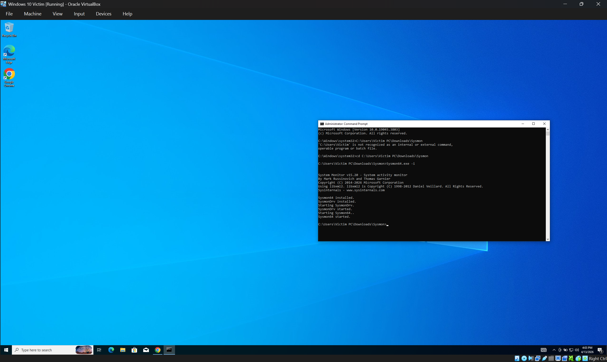
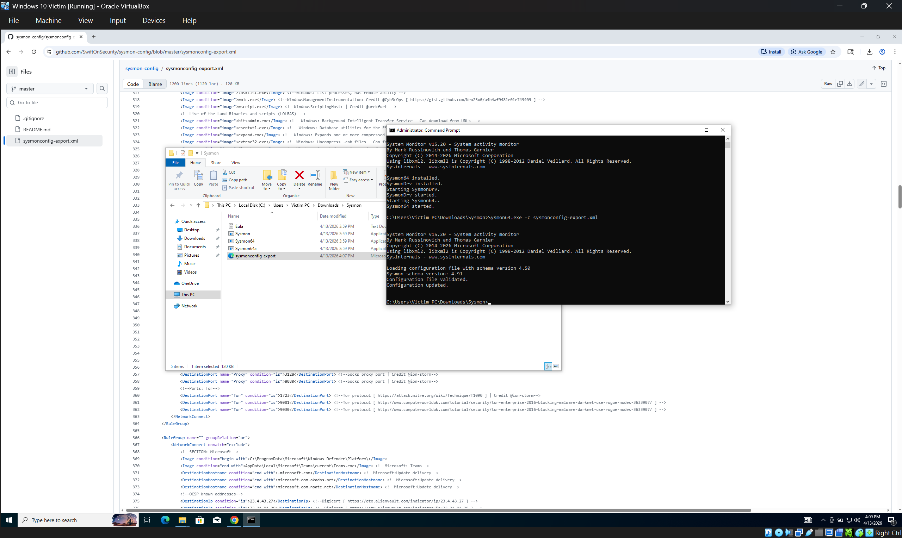
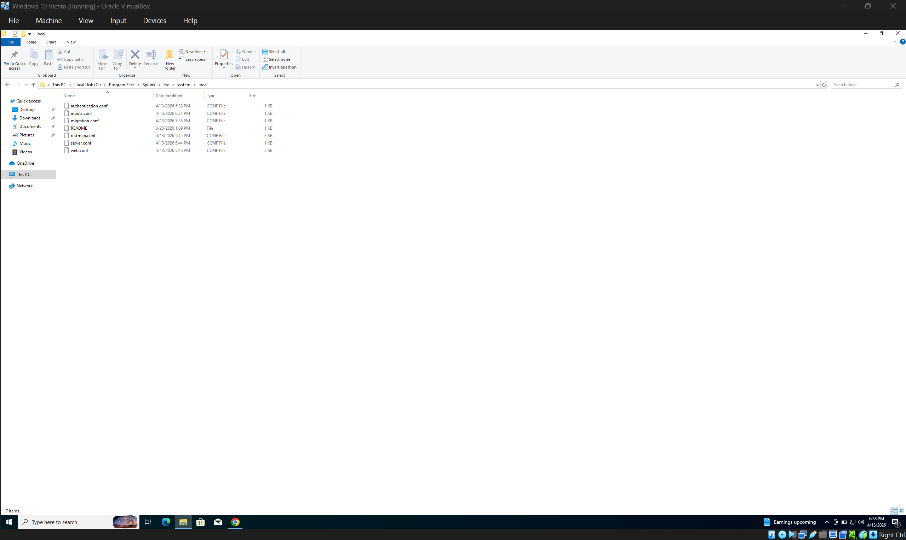
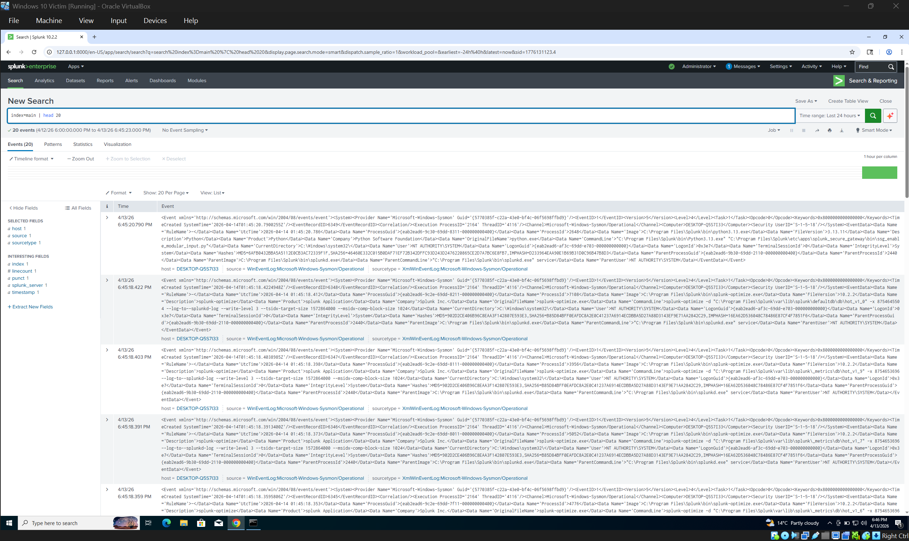
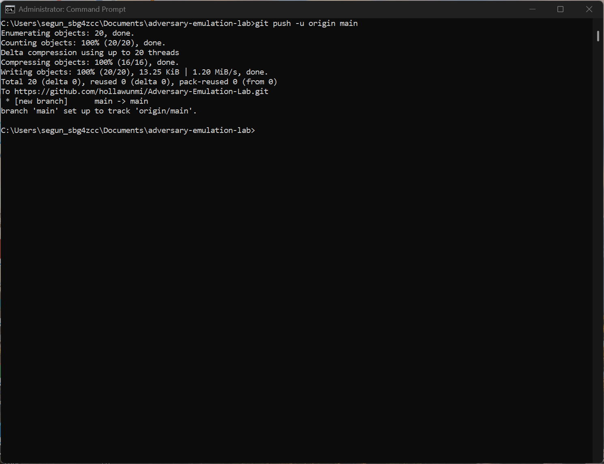
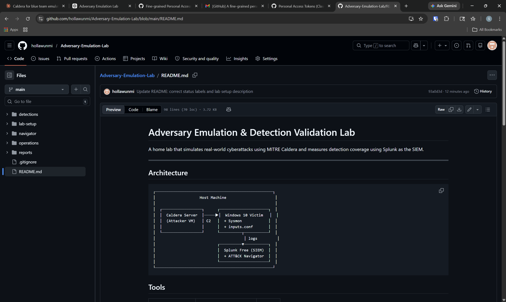

# Lab Setup

This document covers the full configuration of the adversary emulation lab environment.

---

## Environment Overview

| Component | Details |
|---|---|
| Host Machine | Windows 11, VirtualBox 7.x |
| Attacker VM | Kali Linux (Caldera C2 server) |
| Victim VM | Windows 10 22H2 |
| SIEM | Splunk Enterprise Free (localhost:8000) |
| Network | Host-Only Adapter (isolated) |

---

## Step 1 — Sysmon Installation

Sysmon v15.20 was installed on the Windows 10 victim VM using an Administrator command prompt.

```cmd
Sysmon64.exe -accepteula -i
```

The SwiftOnSecurity configuration was then applied:

```cmd
Sysmon64.exe -c sysmonconfig-export.xml
```

Confirmation output:
- Configuration file validated
- Configuration updated




---

## Step 2 — Splunk Configuration

Splunk Enterprise Free was installed on the Windows 10 victim VM and accessed at http://localhost:8000.

The following inputs.conf was created at:
`C:\Program Files\Splunk\etc\system\local\inputs.conf`

[WinEventLog://Application]
index = main
disabled = false
[WinEventLog://Security]
index = main
disabled = false
[WinEventLog://Microsoft-Windows-Sysmon/Operational]
index = main
disabled = false
renderXml = true


Splunk was restarted after saving:

```cmd
cd "C:\Program Files\Splunk\bin"
splunk restart
```



---

## Step 3 — Verification

Sysmon logs confirmed flowing into Splunk using this search: index=main source="XmlWinEventLog:Microsoft-Windows-Sysmon/Operational" | head 20

Result: 20 events returned confirming live Sysmon telemetry ingestion.



---

## Step 4 — GitHub Repository

Project repository created and pushed to GitHub:

- Repository: https://github.com/hollawunmi/Adversary-Emulation-Lab
- Initial commit: 12 files including README, SPL detections, Sysmon config, operation templates and Navigator layer




---

## Current Status

- [x] Sysmon v15.20 installed and configured
- [x] Splunk ingesting Windows and Sysmon logs
- [x] GitHub repo live with full project structure
- [ ] Caldera installed on Kali VM
- [ ] Network connectivity verified between VMs
- [ ] First Caldera operation run
