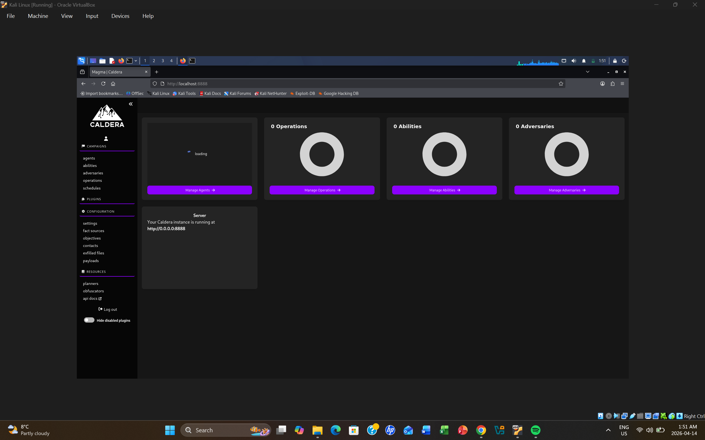
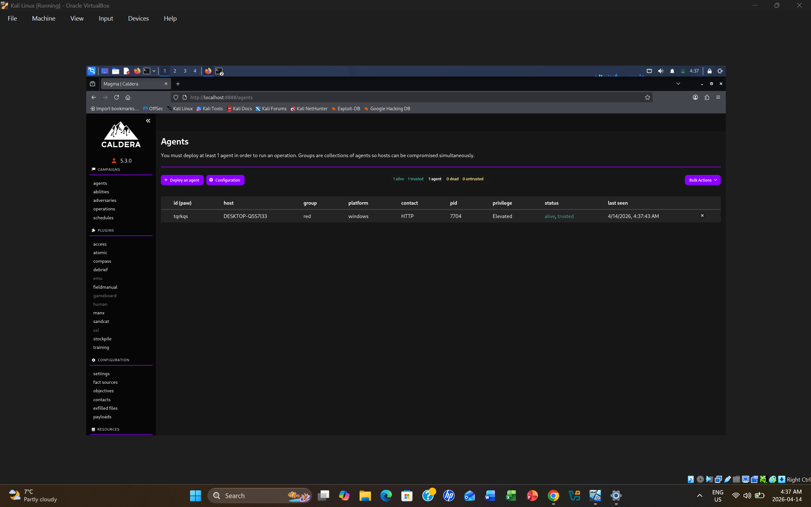
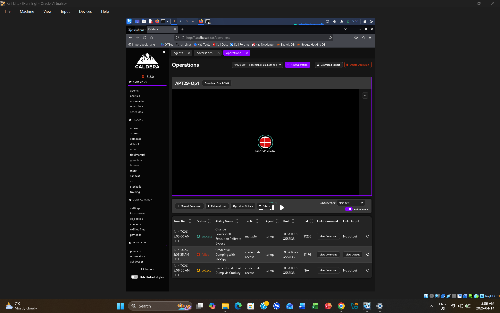
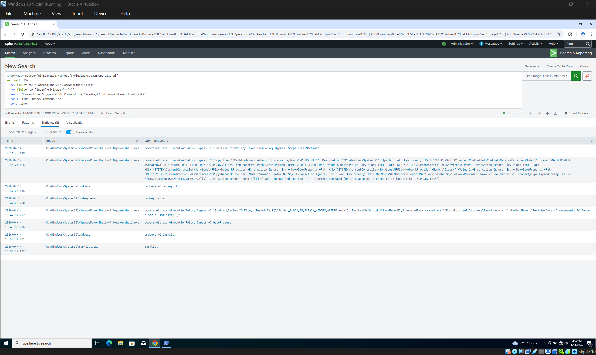
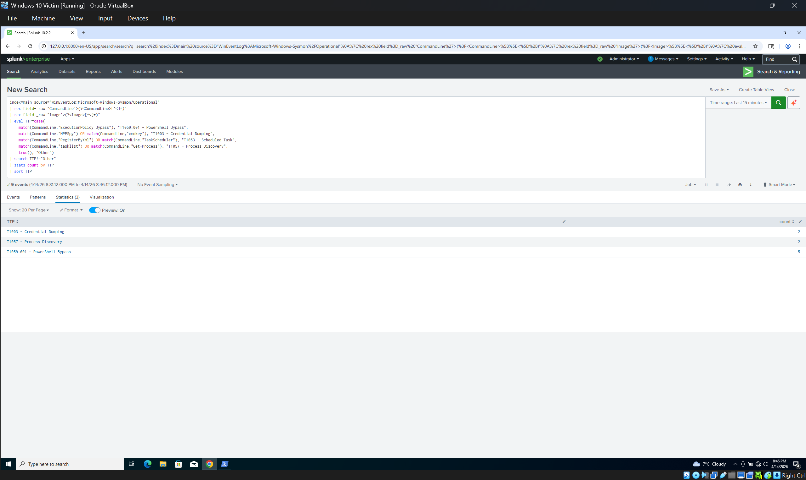

# APT29 Operation 1 — Log

## Operation Overview
- **Date:** April 14, 2026
- **Platform:** MITRE Caldera 5.3.0
- **Adversary Profile:** APT29 (Cozy Bear)
- **Target:** Windows 10 VM (DESKTOP-Q5S7I33)
- **Agent:** Sandcat (HTTP beacon, elevated privileges)
- **Detection Stack:** Splunk + Sysmon v15.20

---

## TTPs Executed

| # | Technique | ID | Status | Detected |
|---|-----------|-----|--------|---------|
| 1 | Change PowerShell Execution Policy to Bypass | T1059.001 | Success | ✅ Yes |
| 2 | Credential Dumping with NPPSpy | T1003 | Collected | ✅ Yes |
| 3 | Cached Credential Dump via Cmdkey | T1003 | Success | ✅ Yes |
| 4 | Import XML Scheduled Task with Hidden Attribute | T1053.005 | Success | ✅ Yes |
| 5 | System Network Configuration Discovery | T1016 | Success | ⚠️ Partial |
| 6 | System Information Discovery | T1082 | Success | ⚠️ Partial |
| 7 | Process Discovery - Get-Process | T1057 | Success | ✅ Yes |
| 8 | Process Discovery - tasklist | T1057 | Success | ✅ Yes |

---

## Detection Results

| Detection Rule | ATT&CK ID | Events Found | Result |
|---------------|-----------|-------------|--------|
| PowerShell Execution Policy Bypass | T1059.001 | 5 | 🟢 Detected |
| Credential Dumping - NPPSpy + cmdkey | T1003 | 2 | 🟢 Detected |
| Scheduled Task via RegisterByXml | T1053.005 | 1 | 🟢 Detected |
| Process Discovery - tasklist/Get-Process | T1057 | 2 | 🟢 Detected |

**Overall Coverage: 4/7 techniques = 57% detected**

---

## Key Findings

1. **PowerShell abuse was the most active TTP** — 5 separate events showing Caldera
   using PowerShell with ExecutionPolicy Bypass to run malicious commands.

2. **Credential harvesting was partially successful** — NPPSpy was installed and
   cmdkey was used to list saved credentials. Both were detected by Sysmon.

3. **Scheduled task persistence was stealthy** — used XML import method with hidden
   attribute to avoid basic schtasks detection. Detected via RegisterByXml in CommandLine.

4. **Windows Defender initially blocked Sandcat** — flagged as
   Trojan:Win64/SandCat.RTSIMTB. Required real-time protection disabled to deploy.
   This is realistic — real APT29 uses signed binaries to bypass AV.

---

## Screenshots
- 
- 
- 
- 
- 
